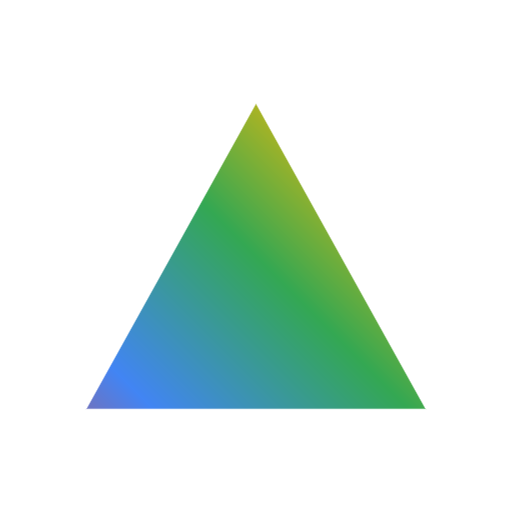

<p align="center">
  
</p>
<h1 align="center">Prism</h1>

<p align="center">
  <strong>Windows Desktop AI Agent powered by Google Gemini 3</strong>
</p>

### Overview

Prism is a windows desktop ai agent that can understand what is on your screen and safely automate real tasks across applications. It combines an electron overlay ui with a fastapi backend and a tool execution loop powered by the google-gemini-3-api.

Prism supports two high level behaviors:
- chat for direct questions and summaries
- task execution for multi step desktop automation with streaming progress, verification, and recovery

---

## How-it-works

Prism is built as two cooperating services:

- `electron-app`
  - always on top desktop shell
  - tray integration and global shortcut
  - chat ui with task bubbles
  - communicates with the backend over http and server-sent-events at `http://127.0.0.1:8000`

- `python-backend`
  - fastapi service for intent routing, planning, execution, streaming updates, and session capture
  - desktop automation using pyautogui plus windows specific actions
  - browser automation using keyboard and url flows and playwright actions
  - visual memory capture and visual-dom scanning endpoints

high level execution loop
1. accept a user command in the ui
2. route into a fast path or a strict task path
3. plan actions with gemini and structured outputs
4. execute actions locally on the desktop or in the browser
5. stream task progress to the ui
6. verify outcomes and retry when needed

---

## Features

### core-execution
- natural language command execution via `/execute` and `/execute-stream`
- real time streaming task progress and reply chunks over server-sent-events
- preset workflow execution via `/execute-preset`
- stop and reset controls via `/stop` and `/reset`

### fast-and-strict-intent-paths
- fast direct chat path for question style prompts
- fast app open path for `open launch start <app>`
- strict browser navigation path for `open <browser> and go to <site>`
- strict attached file summarize then open google doc flow using `https://docs.new`
- strict attached file send flow using whatsapp web `https://web.whatsapp.com`

### desktop-automation-actions
- open and focus apps and windows
- click type scroll drag drop
- tab and window navigation, back forward refresh, address bar navigation
- system actions including windows bluetooth toggle
- file attachment helpers
  - select a file in a dialog
  - copy file to clipboard and paste

### file-workflows
- attach files from the ui using picker and drag drop
- document centric flows for read summarize and downstream actions
- attachment bubble lifecycle in the ui

### visual-memory
- periodic screenshot session capture default every `15s`
- ocr and redaction integration
- endpoints
  - `/memory-status`
  - `/memory-toggle`
  - `/memory-clear`
- auto wipe by time window default `180 min`
- auto reset when storage cap is exceeded default `500 MB`

### visual-understanding and visual-dom
- screen analysis and summarization actions
- visual-dom scan and query endpoints
  - `/visual-dom/scan`
  - `/visual-dom/elements`
  - `/visual-dom/interactive`
  - `/visual-dom/forms`
  - `/visual-dom/find`
  - `/visual-dom/overlay`

### electron-ux
- global shortcut support default `alt+space`
- settings panel and api key setup flow
- task and status ui with streaming updates
- automation overlay support through main process ipc

---

## Quickstart-windows

### prerequisites
- windows 10 or 11
- python 3.11 recommended
- nodejs and npm
- google-gemini-api-key from google-ai-studio

### 1 start-backend
from a terminal

```powershell
cd python-backend
python -u main.py
